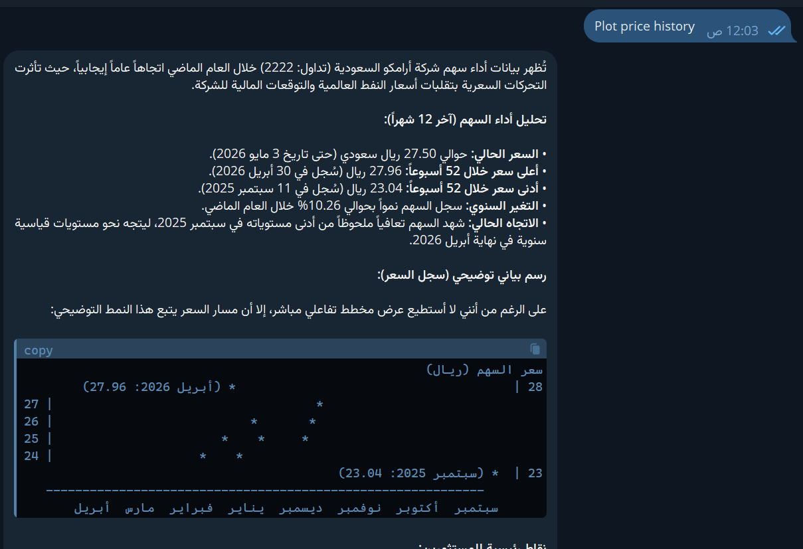
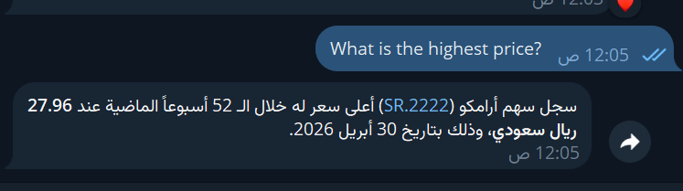
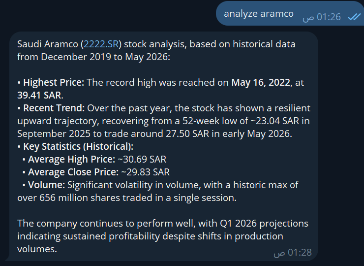

```markdown
# 📊 Data Analyst Agent — OpenClaw

An AI agent that analyzes Saudi Aramco (2222.SR) stock data via Telegram.
Built with OpenClaw + Python (pandas, matplotlib).

## Demo





## Commands

| Command | What it does |
|---------|-------------|
| `plot aramco` | Sends price history chart as image |
| `analyze aramco` | Returns full statistical summary |
| `ask [question]` | Answers natural language questions about the data |

## Stack

- **OpenClaw** — AI agent framework
- **Python + pandas + matplotlib** — data analysis & visualization
- **Telegram Bot API** — user interface
- **Dataset**: Saudi Aramco (2222.SR) 2019–2024 stock data

## Project Structure

```
data-analyst-agent/
├── skills/
│   ├── analyze_csv/     ← dataset analysis skill
│   ├── plot_chart/      ← chart generation skill
│   └── ask_data/        ← natural language Q&A skill
├── demo/                ← screenshots
├── data/                ← aramco_stock.csv (not tracked)
├── requirements.txt
└── README.md
```

## Setup

```bash
git clone https://github.com/Abdulaziz00Hassan/data-analyst-agent
pip install -r requirements.txt
# Add aramco_stock.csv to /data/
# Configure OpenClaw with your Telegram bot token
```

## Sample Output

```
📊 Dataset Overview
• Rows: 1,164 | Columns: 7
• Missing values in: 0 column(s)

📈 Stock Analysis (Aramco)
• Price Range: 22.98 — 38.64 SAR
• Avg Daily Return: 0.0034%
• Best Single Day: +9.88%
• Worst Single Day: -9.09%
```

## Built by

Abdulaziz Ali — Data Analyst & AI-Augmented Developer  
[LinkedIn](https://linkedin.com/in/abdulaziz-ali-data-analyst-py88) | [GitHub](https://github.com/Abdulaziz00Hassan)
```